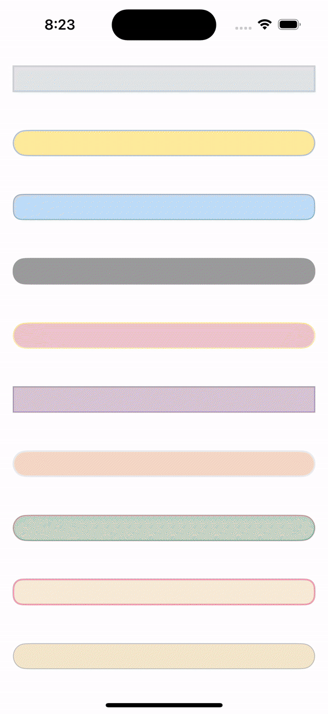

# PromIOS Development course 2024
Репозиторий представляет из себя дизайн-систему, созданную студентами курса.\
Ниже вы можете ознакомиться с `UIKit` и `SwiftUI` представлениями и их использованием. 

### ProgressBar
UI-компонент, отвечающий за статус загрузки.
Оба реализации имеет общую сигнатуру инициализации и выставления прогресса для `UIKit` и `SwiftUI` моделей:

```swift
import SwiftUIElements // or import UIKitElements

let style = HSEStyle(...)
let progressBar = ProgressBar(style: style)
progressBar.setProgress(value: 0.8)
```




### Tailwind card
UI-компонент, отвечающий за отображение карточки с информацией, а также дает возможность выбирать карточку, при нажатии на нее. Тут, также, работает анимация плавного перехода при выборе карточки.

Для примера, я объединил карточки в ленту, чтобы показать, как они могут использоваться вместе.


Чтобы использовать компонент SwiftUI у себя в коде, достаточно создать экземпляр `TailwindCard` и передать в него необходимые параметры:
```swift
SwiftUICardView(
    title: "Заголовок",
    mainText: "Основной текст",
    footerText: "Информационная строка снизу",
    backgroundColor: .blue
)
```
Пример на UIKit:
```swift
let cardView = UIKitCardView(
    title: "Заголовок",
    mainText: "Основной текст",
    footerText: "Текст в подвале",
    imageBackgroundColor: .lightGray
)
```

### CircularSlider for SwiftUI & RangeSlider for UIKit

#### Пример использования CircularSlider
Описание каждого параметра указано в коде
 ```
 import SwiftUI

struct ContentView: View {
    @State private var startRange: Int? = nil
    @State private var endRange: Int = 80

    var body: some View {
        VStack {
            CircularSlider(startRange: $startRange, endRange: $endRange, factor: 100)
                .padding(20)
            
            Text("Start Range: \(startRange ?? 0)")
            Text("End Range: \(endRange)")
        }
    }
}

 ```
 
 
#### Пример использования RangeSlider
```
class ViewController: UIViewController {
    let rangeSlider = RangeSlider(frame: .zero)
    
    override func viewDidLoad() {
        super.viewDidLoad()
        
        
        view.addSubview(rangeSlider)
        rangeSlider.addTarget(self, action: #selector(rangeSliderValueChanged(_:)),
                              for: .valueChanged)
        let time = DispatchTime.now() + 1
        DispatchQueue.main.asyncAfter(deadline: time) {
            self.rangeSlider.trackHighlightTintColor = .blue
            self.rangeSlider.thumbImage = UIImage(systemName: "circle.fill")!
        }
        
        
    }
    
    override func viewDidLayoutSubviews() {
        let margin: CGFloat = 20
        let width = view.bounds.width - 2 * margin
        let height: CGFloat = 30
        
        rangeSlider.frame = CGRect(x: 0, y: 0,
                                   width: width, height: height)
        rangeSlider.center = view.center
    }
    
    @objc func rangeSliderValueChanged(_ rangeSlider: RangeSlider) {
        let values = "(\(rangeSlider.lowerValue) \(rangeSlider.upperValue))"
        print("Range slider value changed: \(values)")
    }
    
}
```

